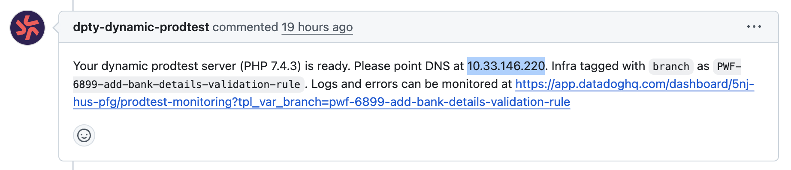
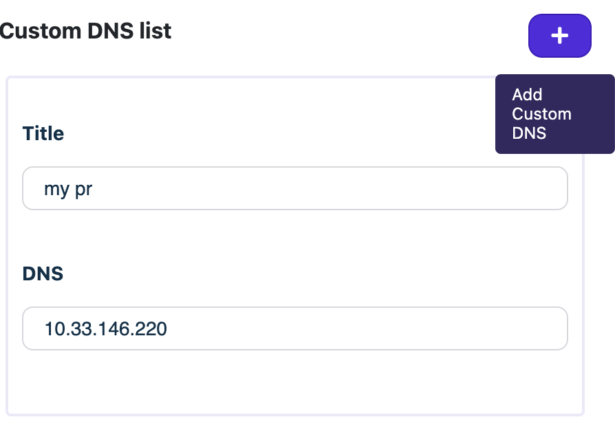

# Daily Note

- This note is focus on writing the some essential notes for daily works

## `prodtest` setup

Here are the steps:

> 1. Go to Github, and select the label of `prodtest server` from labels area in the PR
> 2. Always remember to wait for `artefact-ready` to show then start to do the prodtest (Normally wait for 10 -15 mins)
> 3. Setup Deputy Cafe `dns` address with auto generated the message from github PR.
>    Like image shown below

> Then, `add` dns into `Deputy Cafe` app

> 4. (ONLY ask once) Also need to ask team members to invite and click 'Accept' to join the `coconut prodtst` app to start to do the prodtest !!
> 5. Do a loom video record and attach it to Github comment area
