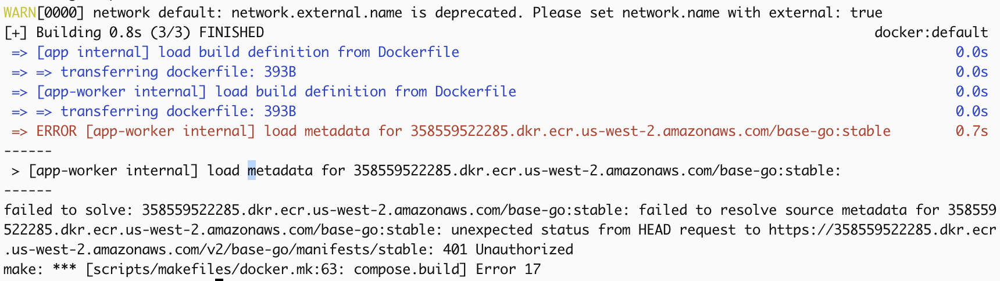

# Error `ERROR [app-worker internal] load metadata for 123123123.dkr.ecr.us-west-2.amazonaws.com/base-go:stable`:


## Error details

```
 => ERROR [app-worker internal] load metadata for 123123123.dkr.ecr.us-west-2.amazonaws.com/base-go:stable        0.7s
------
 > [app-worker internal] load metadata for 123123123.dkr.ecr.us-west-2.amazonaws.com/base-go:stable:
------
failed to solve: 123123123.dkr.ecr.us-west-2.amazonaws.com/base-go:stable: failed to resolve source metadata for 123123123.dkr.ecr.us-west-2.amazonaws.com/base-go:stable: unexpected status from HEAD request to https://123123123.dkr.ecr.us-west-2.amazonaws.com/v2/base-go/manifests/stable: 401 Unauthorized
make: *** [scripts/makefiles/docker.mk:63: compose.build] Error 17
```



Slack chat history record [link](https://deputy.slack.com/archives/C04S7040S8J/p1700522757614589?thread_ts=1700522548.098799&cid=C04S7040S8J)

## Solution for fix

```bash
make docker.pull
```
