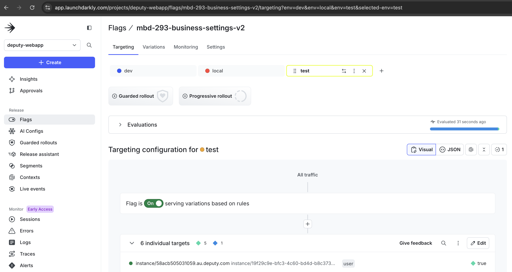

# LaunchDarkly

## What is `Lauchdarkly`

Its a platform to enable and disable feature flags.

## How to use it?

Step 1, create your own business by clicking `Add New business` button at application overview Deputy platform

Step 2, please ask team members for permission, someone will add your business 

Step 3, search for a flag you want to enable, eg: `mbd-293-business-settings-v2`

Step 4, follow the image shown below, create `test` under Trageting tab, usually test tag no need for asking approval, easier for testing

Step 5, also, click `Edit` button to add your business name, like this format: `instance/YOUR_OWN_BUSINESS_NAME`, eg: `instance/58acb505031059.au.deputy.com`

Here is more documentation (Can search from Confluence page), eg:

[Launchdarkly Doc](https://deputy.atlassian.net/wiki/spaces/DEP/pages/1314422791/Launchdarkly+-+Ship+features+with+peace+of+mind)
