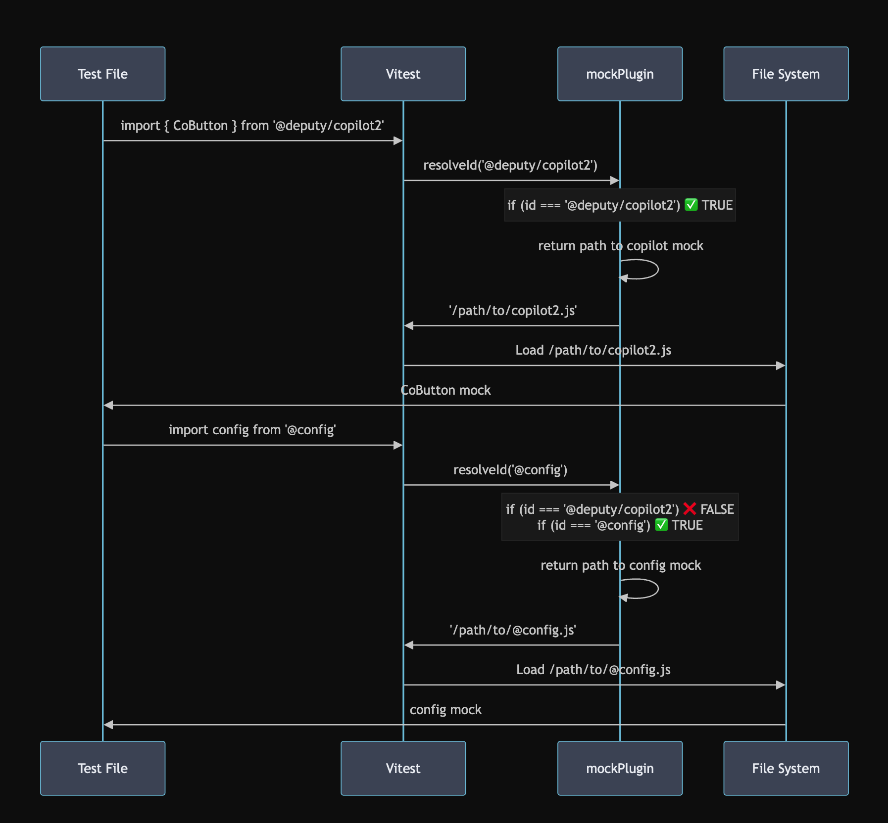

# Unit tests migration (Proposal Plan)

This note is focus on unit tests migration from `Jest` to `Vitest`.

## Major considerations

- Long-term codebase maintenance purpose
- Speed Performance (Faster execution)
- Try to keep the unit tests a bit DRY (instead of define repeat code in multiple test files)

## Reference documentation

The solution is proposed based on following reference documentations:

- [VNEXT+vitest+migration](https://deputy.atlassian.net/wiki/spaces/FPC/pages/4764336383/VNEXT+vitest+migration)
- [File Naming/Structure Conventions Documentation](https://deputy.atlassian.net/wiki/spaces/FPC/pages/3500376351/File+Naming+Structure+Conventions+Documentation#Support%2FHelper-Files)
- [Vitest Migration From Jest](https://vitest.dev/guide/migration.html#jest)
- [Vitest Mocking](https://vitest.dev/guide/mocking.html)

## Proposed solution

### Pre-analysis & thinking

The entire Jest to Vitest unit test migration task would be divided by 2 stages after reading through the current codebase (Please correct me if I missed anything 🙏).

Stage 1: Introduce new Vitest unit tests for current codebase (👈 current focus)

Stage 2: Clean up the exisiting Jest unit tests from codebase

The propsoed solution is mainly focus on one of folders (`frontend/vnext/src/apps/culture`) Jest to Vitest unit test migration. The major goal is to ensure both new added vitest unit tests and exisiting Jest unit tests are fully passed without any errors when running command `npm run test:unit` (A command which runs both Jest + Vitest unit tests together).

**To sum up, introducing `__mocks__` to the Vitest is mainly for providing an additional way for developers to write unit tests for the codebase, developers are still be able to utlise `shallowMount()` and `mount()` way to write unit tests.**

### Actual Solution

Planning to introduce `__mocks__` strategy as part of Vitest unit test migration task.

Here are few reasons (thoughts 🗯️):

1. Loading full component libraries slows down the test execution speed (perfromance consideration)

2. Test isolation: unit tests would focus on business logic testing instead of component library internals (Point support documentation [link](https://vuejs.org/guide/scaling-up/testing#unit-testing))

3. Insufficient isolation with Vue test utils alone, eg:

    ```ts
    // Current approach requires extensive inline mocking
    const wrapper = mount(Component, {
    global: {
        stubs: ['CoButton', 'CoDialog', 'CoIcon', ...], // Becomes unwieldy
        mocks: { $i18n: mockI18n, $store: mockStore, ... }
    }
    });
    ```

    According to above code exmaple, we could see there might be few points we need to consider:

    - Repetitive Setup: Every test file needs identical stub configurations
    - Maintenance Overhead: Component library updates break multiple test files (Might need to change multiple places to fix the unit tests)

4. Flip the coin back, there are few advantages of introducing `__mocks__` strategy:

    - Maintenance Efficiency: Update once (single source of truth), benefit the codebase entriely (DRY consideration)
    - Currently, we are under unit tests migration stage, it would be easier for both Jest and Vitest to use `__mocks__` with minimal adaption
    - Backward compatiability: Existing Jest tests continue working while new Vitest tests are added
    - Version Control: Mock evolution tracked alongside code changes

### How to implement (Action Plan)

- Created a `vitest-mocks` folder under `__mocks__` folder (Extending the usage of exisitng `__mocks__` folder) - [Reference Link](https://vitest.dev/api/vi.html#mock-modules)
- Created a mock plugin file `vitest-mock-plugin.ts` for register the third party mocks into this centralized config file (Getting the idea from Vitest mocking documentation [Reference Link 1](https://vitest.dev/guide/mocking) & [Reference Link 2](https://vitest.dev/guide/migration.html#module-mocks))
- Import `mockPlugin()` inside `vitest.config.ts` file for utlizing those mock plugins (Below diagram shows how the dynamic import mocks works)


### How to handle the complicated mocking cases

This is a brief introduction of how to use mocks to do Vitest based unit tests, here are few exmaples to demonstrate how to implement it case by case. In future, with more and more new unit tests introduced, more and more different examples would be provided.

Here are some scenarios which utlizing mocking strategy to handle the unit tests (case by case), which is for overriding the mock components inside `__mocks__/vitest-mocks/@deputy/copilot2.js`:

1. If we need to test a bit more complex component with slots and events, we could do the mock overrides, one simple example based on current codebase:

```ts
// From schedule-shift-repeat-pattern.spec.ts - OVERRIDING the simple __mocks__
jest.mock('@deputy/copilot2', () => {
  const vue = require('vue');
  
  return {
    CoDialog: {
      props: ['modelValue', 'customClass', 'width', 'appendToBody'],
      render() {
        return vue.h('div', { class: 'co-dialog' }, [
          vue.h('div', { class: 'dialog-header' }, this.$slots?.title?.()),
          vue.h('div', { class: 'dialog-content' }, this.$slots?.default?.()),
          vue.h('div', { class: 'dialog-footer' }, this.$slots?.footer?.()),
        ]);
      },
    },
    CoButton: {
      props: ['type'],
      render() {
        return vue.h('button', { class: 'mock-button' }, this.$slots?.default?.());
      },
    },
    // ... much more sophisticated than the simple __mocks__ version
  };
});
```

2. One of practical examples: behavioral mocks with state:

There might be a complicated mock test cases required based on the business logic written inside the component, and the `override` simple `__mocks__` could be considered for handling the complex behavioral uni tests.

We could find one of exmaples from current codebase: `frontend/vnext/src/apps/culture/src/modules/engagement/tests/engagement-widget-sentiment.spec.ts`

3. Potentially, there is a progressive enchancement pattern - 80/20 rule (80% for simple mocks unit test cases, 20% for complex behaviour based unit test cases) for helping developers to write unit tests:

- **Basic Tests (80% of cases):**
    - Use simple __mocks__ automatically
    - Test core functionality fast
    - Reliable, consistent results
    - Cover most scenarios efficiently

- **Enhanced Tests (20% of cases):**
    - Add when you need complex behavior testing
    - Use separate describe blocks for organization
    - Test interactions, events, state changes
    - More detailed verification when needed

One of examples could be found from codebase: `frontend/vnext/src/apps/culture/src/modules/engagement/tests/engagement-pulse-card.spec.ts`


### Use cases for utilising `shallowMount()` or `mount()`

As mentioned before, mocks is like an additional way to write unit tests. Here are some unit test scenarios of using `shallowMount()` or `mount()` to write the unit tests which is also encouraged to continue to do.

1. `shallowMount()` its perfect for simple, isolated component testing, the good example could be found from codebase: `frontend/vnext/src/apps/culture/src/modules/engagement/tests/engagement-pulse-card-title.spec.ts`

2. `mount()` its good for integration testing and component interactions, the good example could be found from codebase: `frontend/vnext/src/apps/culture/src/modules/engagement/tests/engagement-widget-comments.spec.ts`\

&nbsp;

**Thank you everyone for reading this proposal plan, and pleaase let me know if there is anything I have missed, I am more than happy to correct myself. Thank you team ❤️ ~**